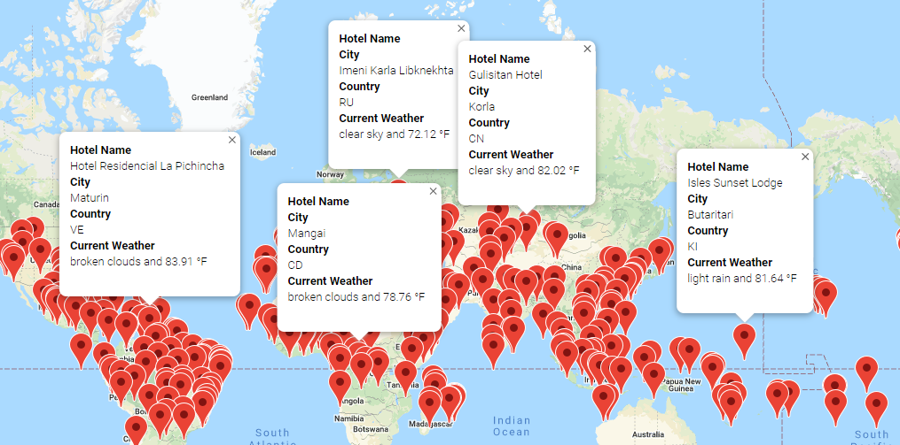
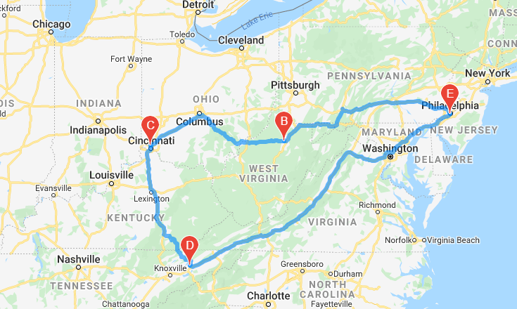

# World_Weather_Analysis
Performing analysis on a travel company data

## Overview of the analysis
The head of analysis of a top travel technology company that specializes in the hotel and lodging industry will be assisted with analyzing the company data in order to recommned the best cities for vacation anywhere in the world based on clients weather criteria/preferences. The analysis was performed using Jupyter Notebook, Pandas Library, CityPy Module, APIs and JSON Traversals.<br />

The three technical analyses and the project deliverables are <br />

1. Retrieve Weather Data
    - Generate a set of 2,000 random latitudes and longitudes.
    - Get the nearest city using the *citipy* module.
    - Perform an API call with the OpenWeatherMap.
    - Retrieve information including the current weather description for each city.
    
2. Create a Customer Travel Destinations Map
    - Use input statements to retrieve customer weather preferences.
    - Use the customer weather preferences to identify potential travel destinations and nearby hotels.
    - Show the destinations on a marker layer map with pop-up markers

3. Create a Travel Itinerary Map
    - Create four DataFrames, one for each city chosen from the customer’s possible travel destinations.
    - Retrieve the latitude and longitude pairs for each of the four cities
    - Use the Google Directions API to create a travel itinerary that shows the route between four cities.
    - Create a marker layer map with a pop-up marker for each city on the itinerary


## Resources
- Data Source: This analysis was performed using the [WeatherPy_Database.csv](https://github.com/aobasuyi/World_Weather_Analysis/blob/main/Weather_Database/WeatherPy_Database.csv) and the [WeatherPy_vacation.csv](https://github.com/aobasuyi/World_Weather_Analysis/blob/main/Vacation_Search/WeatherPy_vacation.csv) datasets.
- APIs: OpenWeather maps, Google Maps.
- Software: Python 3.7.6 :: Anaconda, Inc., conda 4.10.1, Jupyter Notebook, Visual Studio Code, 1.56

## World_Weather Analysis
 <br />

A.  **Retrieve Weather Data** <br />

Code to create a list holding the new cities weather: <br />

```
# Import the dependencies.
import pandas as pd
import matplotlib.pyplot as plt
import numpy as np

# Create a set of random latitude and longitude combinations.
lats = np.random.uniform(low=-90.000, high=90.000, size=2000)
lngs = np.random.uniform(low=-180.000, high=180.000, size=2000)
lat_lngs = zip(lats, lngs)
lat_lngs

# Citipy module to determine city based on latitude and longitude.
from citipy import citipy

# Add the latitudes and longitudes to a list.
coordinates = list(lat_lngs)

# Create a list for holding the cities.
cities = []
# Identify the nearest city for each latitude and longitude combination.
for coordinate in coordinates:
    city = citipy.nearest_city(coordinate[0], coordinate[1]).city_name

    # If the city is unique, then we will add it to the cities list.
    if city not in cities:
        cities.append(city)
# Print the city count to confirm sufficient count.
len(cities)
```

**Result:**  <br /> The new City Weather DataFrame: <br />

<br />  <br />


B.  **Create a Customer Travel Destinations Map - Vacation Search** <br />

Some of the codes used include:

```
# Dependencies and Setup
import pandas as pd
import requests
import gmaps

# Import API key
from config import g_key

# Configure gmaps API key
gmaps.configure(api_key=g_key)

weather_data_df = pd.read_csv("File.csv")
weather_data_df.head()

# Prompt the user to enter minimum and maximum temperature criteria 
min_temp = float(input("What is the minimum temperature you would like for your trip? "))
max_temp = float(input("What is the maximum temperature you would like for your trip? "))

# Filter the city_data_df DataFrame using the input statements to create a new DataFrame using the loc method.
preferred_cities_df = weather_data_df.loc[(weather_data_df["Max Temp"] <= max_temp) & (weather_data_df["Max Temp"] >= min_temp)]

# Set parameters to search for hotels with 5000 meters.
params = {
    "radius": 5000,
    "type": "lodging",
    "key": g_key
}

# Iterate through the hotel DataFrame.

# Use the template  and add city name, the country code, the weather description and maximum temperature for the city.
info_box_template = """
<dl>
<dt>Hotel Name</dt><dd>{Hotel Name}</dd>
<dt>City</dt><dd>{City}</dd>
<dt>Country</dt><dd>{Country}</dd>
<dt>Current Weather</dt><dd>{Current Description} and {Max Temp} °F</dd>
</dl> """

#  Get the data from each row and add it to the formatting template and store the data in a list.
hotel_info = [info_box_template.format(**row) for index, row in clean_hotel_df.iterrows()]

# Get the latitude and longitude from each row and store in a new DataFrame.
locations = clean_hotel_df[["Lat", "Lng"]]

```
**Result:**  <br />

<br />  <br />


C.  **Create a Vacation Itinerary Map** br />
T0 create a travel itenarary: <br />

```
# Dependencies and Setup
import pandas as pd
import requests
import gmaps

# Import API key
from config import g_key

# Configure gmaps
gmaps.configure(api_key=g_key)

#Read the WeatherPy_vacation.csv into a DataFrame.
vacation_df = pd.read_csv("File.csv")

#Use the template add the city name, the country code, the weather description and maximum temperature for the city.
info_box_template = """
<dl>
<dt>Hotel Name</dt><dd>{Hotel Name}</dd>
<dt>City</dt><dd>{City}</dd>
<dt>Country</dt><dd>{Country}</dd>
<dt>Current Weather</dt><dd>{Current Description} and {Max Temp} °F</dd>
</dl>
"""

#  Get the data from each row and add it to the formatting template and store the data in a list.
hotel_info = [info_box_template.format(**row) for index, row in df.iterrows()]

#  Get the latitude and longitude from each row and store in a new DataFrame.
locations = df[["Lat", "Lng"]]

#  Add a marker layer for each city to the map.

# Create DataFrames for each city by filtering the 'df' using the loc method. 
# Hint: The starting and ending city should be the same city.

vacation_start = df.loc[df["City"] == "vacation_start"]
vacation_end = df.loc[df["City"] == "vacation_end"]
vacation_stop1 = df.loc[df["City"] == "stop1"]
vacation_stop2 = vadf.loc[df["City"] == "stop2"] 
vacation_stop3 = df.loc[df["City"] == "stop3"] 

# Get the latitude-longitude pairs as tuples from each city DataFrame using the to_numpy function and list indexing.
start = vacation_start["Lat"].to_numpy()[0], vacation_start["Lng"].to_numpy()[0]
end = vacation_start["Lat"].to_numpy()[0], vacation_start["Lng"].to_numpy()[0]

stop1 = vacation_stop1["Lat"].to_numpy()[0], vacation_stop1["Lng"].to_numpy()[0]
stop2 = vacation_stop2["Lat"].to_numpy()[0], vacation_stop2["Lng"].to_numpy()[0]
stop3 = vacation_stop3["Lat"].to_numpy()[0], vacation_stop3["Lng"].to_numpy()[0]

# Create a direction layer map using the start and end latitude-longitude pairs,
# and stop1, stop2, and stop3 as the waypoints.

# Repeat this step (Use the template add city name, the country code, the weather description and maximum temperature for the city) for the new DataFrame

#  Add a marker layer for each city to the map.
```
**Results:**  <br />

<br />  <br />

<br />  <br />


